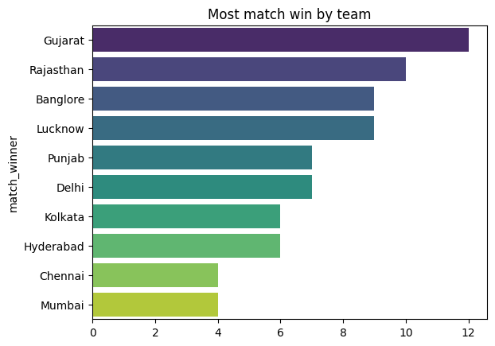
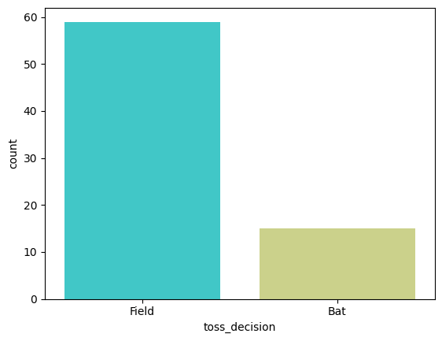
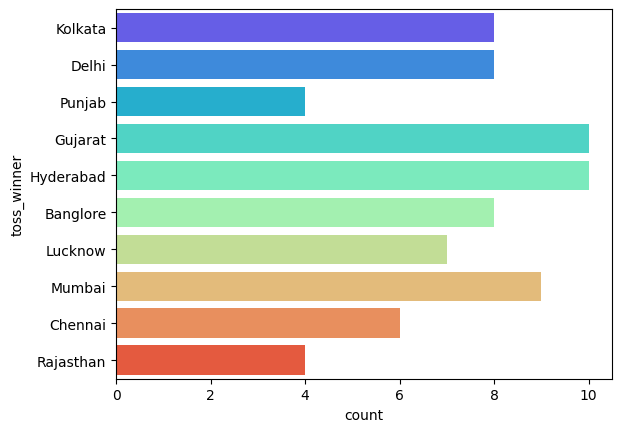
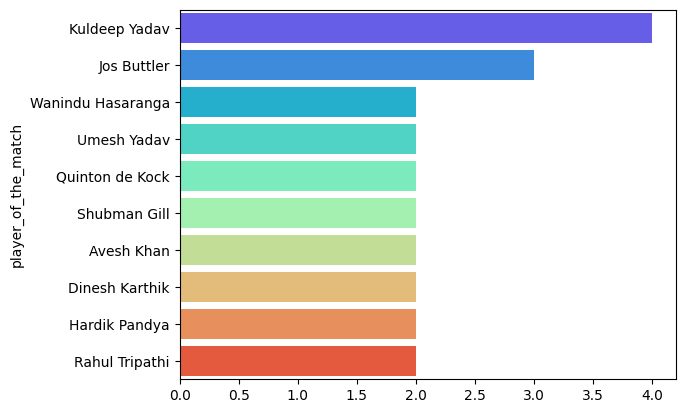
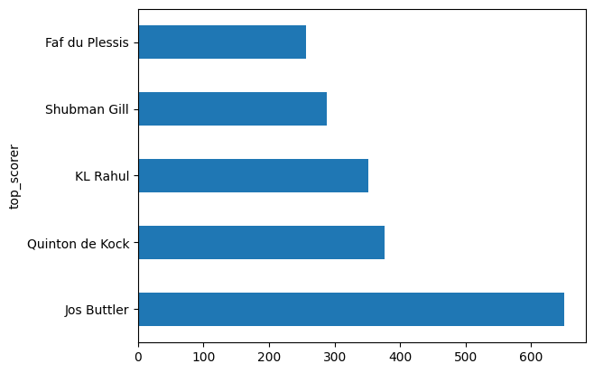
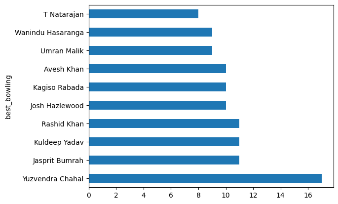
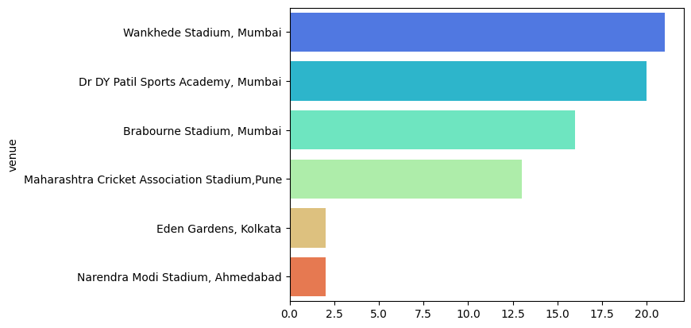

# 🏏 Cricket-Data-Analytics-IPL

A complete data analysis and visualization project based on the 2022 Indian Premier League (IPL) season. This project uncovers match trends, player performances, venue stats, and strategic insights using Python, Pandas, Matplotlib, and Seaborn — with clear visual storytelling.

## 📊 Project Highlights

- ✅ Analyzed 74 IPL matches from 2022
- 🏆 Identified top teams and players
- 🎯 Explored toss decisions and match outcomes
- 📈 Visualized scoring, bowling, and venue patterns
- 📊 Included 12+ charts and plots for better understanding

## 🧰 Tools & Technologies

- Python
- Pandas
- NumPy
- Matplotlib
- Seaborn

## 📂 Dataset

- Format: CSV
- Fields: match date, venue, teams, scores, toss decisions, winners, player of the match, top scorer, best bowling figures, etc.

## 📌 Key Analyses & Visuals

### 1. 🏆 Most Match Wins by Team
- **Bar Chart** showing which teams won the most matches

### 2. 🎲 Toss Decision Trends
- **Count Plot** of toss decisions (Bat/Field)
- **Count Plot** of toss winners by team

### 3. 🎯 Toss Winner vs Match Winner
- Percentage of matches where toss winner also won the match

### 4. 🏁 Win Type Distribution
- **Count Plot** showing wins by Runs vs Wickets

### 5. 🌟 Top 'Player of the Match' Awards
- **Bar Chart** of top 10 players with most awards

### 6. 🏏 Top Scorers
- **Horizontal Bar Chart** of top 5 batsmen by total runs

### 7. 🎯 Best Bowling Figures
- **Horizontal Bar Chart** of top 10 bowlers by total wickets

### 8. 🏟️ Venue Analysis
- **Bar Chart** showing number of matches played at each stadium

### 9. 🚀 Highest Win Margin (Runs)
- Match with the largest run margin

### 10. 🔥 Highest Individual Score
- Player with the highest single-match score

### 11. 🎯 Best Bowling Performance
- Bowler with the best single-match bowling figure


## 📸 Sample Visuals  
Here’s a glimpse of the visualizations included:

### 🏆 Most Match Wins by Team  


### 🧢 Toss Decision Trends  


### 🏁 Win Type Distribution  


### 🌟 Top Player of the Match Awards  


### 🏏 Top Scorers  


### 🎯 Best Bowling Figures  


### 🏟️ Venue Analysis  



> 📁 All plots are saved in the `/images` folder. You can regenerate them by running the script.

## 🚀 How to Run

```bash
# Clone the repository
git clone https://github.com/yourusername/Cricket-Data-Analytics-IPL.git

# Navigate to the project folder
cd Cricket-Data-Analytics-IPL

# Run the script
python ipl_analysis.py
